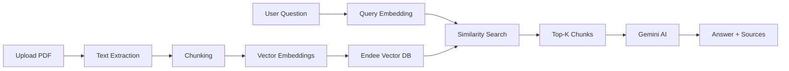

# 🤖 RAG2 - AI Research Paper Assistant

A modern full-stack web application that allows you to upload research papers (PDFs) and ask questions about them using **Retrieval Augmented Generation (RAG)** with the Endee vector database and Gemini AI.

   

## ✨ Features

- 📤 **Drag & Drop PDF Upload** - Easy paper management with beautiful UI
- 💬 **Intelligent Q&A** - Ask natural language questions about your papers
- 📚 **Source Citations** - Get answers with exact references and similarity scores
- 🎨 **Modern UI** - Glassmorphism design with smooth animations
- 🚀 **Fast & Efficient** - Powered by vector similarity search
- 📱 **Responsive** - Works on desktop, tablet, and mobile
- 🔒 **Privacy First** - Your papers stay on your server

## 🚀 Quick Start

### Prerequisites

- Python 3.8+
- Node.js 16+
- Docker (optional, for Endee vector database)

### Installation

1. **Clone the repository:**
   ```bash
   git clone https://github.com/yourusername/RAG2.git
   cd RAG2
   ```

2. **Install backend dependencies:**
   ```bash
   pip install -r requirements.txt
   pip install -r requirements-api.txt
   ```

3. **Install frontend dependencies:**
   ```bash
   cd frontend
   npm install
   cd ..
   ```

4. **Configure environment:**
   ```bash
   copy .env.example .env
   ```
   
   Edit `.env` and add your Gemini API key:
   ```env
   GEMINI_API_KEY=your_api_key_here
   ```

5. **Start the Endee vector database (optional but recommended):**
   ```bash
   docker-compose up -d
   ```

### Running the Application

**Terminal 1 - Backend:**
```bash
python app.py
```
API runs at `http://localhost:8000`

**Terminal 2 - Frontend:**
```bash
cd frontend
npm run dev
```
Frontend runs at `http://localhost:5173`

Open your browser and navigate to `http://localhost:5173` to start using the app!

## 📖 How It Works



1. **Upload**: PDFs are processed and split into semantic chunks
2. **Embed**: Text chunks are converted to vector embeddings
3. **Store**: Embeddings stored in Endee for fast similarity search
4. **Query**: Questions are embedded and matched against stored chunks
5. **Generate**: Gemini generates answers using only retrieved context
6. **Cite**: Sources are displayed with paper name, section, and page

## 🎯 API Endpoints

| Method | Endpoint | Description |
|--------|----------|-------------|
| GET | `/api/health` | Health check |
| GET | `/api/papers` | List uploaded papers |
| POST | `/api/upload` | Upload a PDF |
| POST | `/api/query` | Ask a question |
| POST | `/api/ingest-all` | Re-ingest all papers |

API documentation available at `http://localhost:8000/docs`

## 🏗️ Project Structure

```
RAG2/
├── frontend/              # React frontend
│   ├── src/
│   │   ├── components/    # React components
│   │   ├── services/      # API client
│   │   ├── App.jsx        # Main app
│   │   └── index.css      # Styles
│   ├── index.html
│   └── package.json
│
├── src/                   # Backend Python modules
│   ├── rag_pipeline.py    # RAG orchestration
│   ├── pdf_loader.py      # PDF processing
│   ├── chunker.py         # Text chunking
│   ├── embeddings.py      # Vector embeddings
│   └── endee_store.py     # Vector database client
│
├── app.py                 # FastAPI backend server
├── run.py                 # CLI interface (legacy)
├── requirements.txt       # Python dependencies
├── requirements-api.txt   # API dependencies
├── docker-compose.yml     # Endee deployment
├── .env.example           # Environment template
└── README.md              # This file
```

## 🎨 Tech Stack

**Frontend:**
- React 18
- Vite
- Modern CSS with Glassmorphism
- Custom animations

**Backend:**
- FastAPI
- Python 3.8+
- Sentence Transformers
- Google Gemini AI

**Database:**
- Endee Vector Database
- Docker

## 📋 Configuration

### Environment Variables

```env
# LLM Configuration
GEMINI_API_KEY=your_key_here
LLM_PROVIDER=gemini
LLM_MODEL=gemini-2.5-flash

# Embedding Model
EMBEDDING_MODEL=sentence-transformers
SENTENCE_TRANSFORMER_MODEL=all-MiniLM-L6-v2

# Vector Database
ENDEE_HOST=localhost
ENDEE_PORT=8000

# RAG Settings
CHUNK_SIZE=500
CHUNK_OVERLAP=50
TOP_K=5
SIMILARITY_THRESHOLD=0.7

# CORS (for production)
ALLOWED_ORIGINS=*
```

## 🚀 Deployment

See [DEPLOYMENT.md](./DEPLOYMENT.md) for detailed deployment instructions.

**Quick Deploy:**
- **Frontend**: Deploy to Vercel
- **Backend**: Deploy to Render or Railway
- **Database**: Included in backend deployment

## 🤝 Contributing

Contributions are welcome! Please feel free to submit a Pull Request.

## 📝 License

This project is licensed under the MIT License - see the [LICENSE](LICENSE) file for details.

## 🙏 Acknowledgments

- **Endee** - High-performance vector database
- **Sentence Transformers** - Free embedding models
- **PyMuPDF** - PDF text extraction
- **Google Gemini** - LLM for answer generation
- **FastAPI** - Modern Python API framework
- **React** - UI library

## 📧 Support

If you encounter any issues or have questions:
- Check the [Troubleshooting](#troubleshooting) section
- Review [DEPLOYMENT.md](./DEPLOYMENT.md)
- Open an issue on GitHub

## Troubleshooting

### Cannot connect to API
- Ensure backend is running on port 8000
- Check CORS settings in `.env`
- Verify frontend API URL is correct

### Papers not uploading
- Check `data/papers/` directory exists
- Verify file is a valid PDF
- Check file size (default limit: 100MB)

### Inaccurate answers
- Try uploading more relevant papers
- Increase `TOP_K` in `.env`
- Lower `SIMILARITY_THRESHOLD`

---

**Built with ❤️ for researchers and students**

Need help? Check the docs or open an issue!
