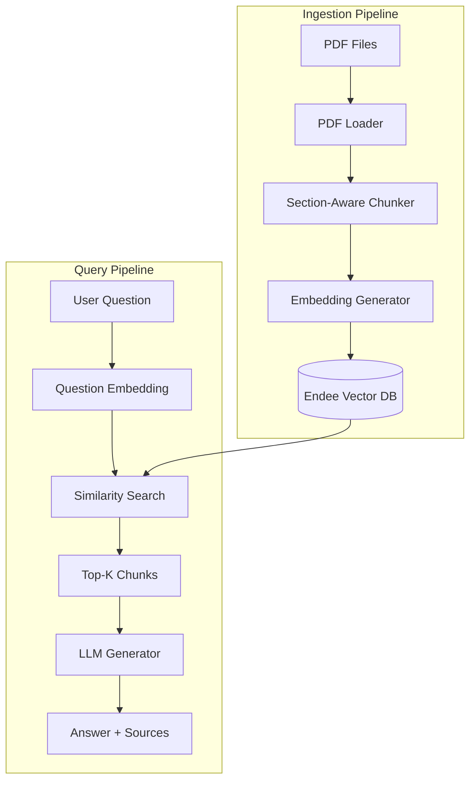

# 🤖 AI Research Paper Assistant with RAG

A powerful application that allows you to upload research papers (PDFs) and ask natural language questions, with answers generated strictly from the paper content using **Retrieval Augmented Generation (RAG)** and **Endee vector database**.

## 📋 Problem Statement

Researchers and students often struggle to efficiently extract specific information from multiple research papers. Reading through dozens of papers is time-consuming and inefficient. This system solves that problem by:

- **Uploading multiple PDFs** at once
- **Asking natural language questions** about their content
- **Getting accurate, grounded answers** with source citations
- **Preventing hallucinations** by strictly using paper content

## 🧠 How RAG Works in This Project

**Retrieval Augmented Generation (RAG)** combines the best of retrieval and generation:


### The Process:

1. **Ingestion**: Papers are split into semantic chunks with metadata (paper name, section, page)
2. **Embedding**: Each chunk is converted to a vector embedding
3. **Storage**: Embeddings stored in Endee for fast similarity search
4. **Query**: User questions are embedded and matched against stored chunks
5. **Retrieval**: Most relevant chunks retrieved (top-k with similarity threshold)
6. **Generation**: LLM generates answer using ONLY the retrieved context
7. **Attribution**: Sources cited with paper name, section, and page numbers

### Why RAG, Not Fine-Tuning?

| Aspect | RAG ✅ | Fine-Tuning ❌ |
|--------|--------|----------------|
| **Dynamic Updates** | Add/remove papers instantly | Requires retraining |
| **Source Attribution** | Exact citations | No traceability |
| **Cost** | Low (inference only) | High (training compute) |
| **Hallucination Risk** | Low (grounded in context) | Higher (memorized knowledge) |
| **Time to Deploy** | Immediate | Hours/days of training |

## 🗄️ How Endee is Used

**Endee** is a high-performance, open-source vector database that powers our similarity search:

- **Fast Vector Operations**: Optimized for cosine similarity search
- **Metadata Storage**: Stores text chunks with paper/section/page metadata
- **Scalable**: Handles thousands of research papers efficiently
- **Local-First**: Runs on your infrastructure (Docker)
- **Simple Integration**: REST API for Python client

### Architecture:



## 🏗️ System Architecture

### Component Breakdown:

1. **PDF Loader** (`pdf_loader.py`)
   - Extracts text from PDFs using PyMuPDF
   - Detects sections: Abstract, Introduction, Methodology, Results, Conclusion
   - Preserves metadata: page numbers, section names

2. **Chunker** (`chunker.py`)
   - Section-aware chunking (respects document structure)
   - Sliding window with overlap for context continuity
   - Each chunk ≈500 characters with 50-char overlap

3. **Embedding Generator** (`embeddings.py`)
   - **Default**: Sentence Transformers (`all-MiniLM-L6-v2`) - FREE, runs locally
   - **Optional**: OpenAI embeddings (`text-embedding-3-small`)
   - Batch processing for efficiency

4. **Endee Vector Store** (`endee_store.py`)
   - REST API client for Endee
   - In-memory fallback if Endee unavailable
   - Cosine similarity search

5. **RAG Pipeline** (`rag_pipeline.py`)
   - Orchestrates end-to-end workflow
   - Hallucination prevention via strict prompting
   - Source attribution system

6. **Main Application** (`run.py`)
   - Setup wizard
   - Ingestion interface
   - Interactive query mode

## 🚀 Installation & Setup

### Prerequisites

- Python 3.8+
- Docker (for Endee)
- (Optional) OpenAI API key

### Step 1: Clone/Navigate to Project

```bash
cd E:\PROJECTS\RAG2
```

### Step 2: Install Dependencies

```bash
pip install -r requirements.txt
```

This installs:
- `PyMuPDF` - PDF processing
- `sentence-transformers` - Free embeddings
- `openai` - Optional LLM/embeddings
- `requests` - HTTP client for Endee

### Step 3: Start Endee Vector Database

```bash
docker-compose up -d
```

Check it's running:
```bash
docker ps
```

You should see `endee-vector-db` container running on port 8000.

> **Note**: If you don't have Docker, the system will use an in-memory fallback (data won't persist).

### Step 4: Configure Environment

```bash
copy .env.example .env
```

Edit `.env` with your settings:

```env
# Optional: OpenAI for better quality (costs money)
OPENAI_API_KEY=sk-...

# Endee Configuration (default works if using docker-compose)
ENDEE_HOST=localhost
ENDEE_PORT=8000

# Embedding Model (sentence-transformers is FREE)
EMBEDDING_MODEL=sentence-transformers

# LLM Model (requires OpenAI key)
LLM_PROVIDER=openai
LLM_MODEL=gpt-3.5-turbo

# RAG Settings
CHUNK_SIZE=500
CHUNK_OVERLAP=50
TOP_K=5
SIMILARITY_THRESHOLD=0.7
```

### Step 5: Add Research Papers

Copy your PDF files to `data/papers/`:

```bash
# Example
copy "C:\Downloads\paper1.pdf" "data\papers\"
copy "C:\Downloads\paper2.pdf" "data\papers\"
```

### Step 6: Run the Application

```bash
python run.py
```

The app will:
1. Auto-ingest all PDFs from `data/papers/`
2. Launch interactive query mode

## 📖 Usage Examples

### Ingesting Papers

```bash
python run.py --ingest
```

Output:
```
📥 INGESTION PIPELINE
================================================================

Processing: attention_is_all_you_need.pdf
  └─ Extracting text...
     ✓ Found 8 sections
  └─ Chunking document...
     ✓ Created 47 chunks

📊 Total chunks to embed: 47

🧮 Generating embeddings...
Batches: 100%|████████████| 2/2 [00:03<00:00]
✓ Generated 47 embeddings

💾 Storing in Endee...
✓ Successfully stored in vector database

✅ INGESTION COMPLETE
```

### Querying the System

```bash
python run.py --query
```

**Example Interaction:**

```
❓ Your question: What is the main contribution of the Transformer architecture?

🔍 Searching papers...

═══════════════════════════════════════════════════════════
💡 ANSWER
═══════════════════════════════════════════════════════════

The main contribution of the Transformer architecture is the introduction
of the self-attention mechanism that allows the model to process sequences
in parallel rather than sequentially, as in RNNs. This enables much faster
training and better capture of long-range dependencies.

═══════════════════════════════════════════════════════════
📚 SOURCES
═══════════════════════════════════════════════════════════

[1] attention_is_all_you_need - Abstract
    📄 Page: 1
    🎯 Similarity: 0.847
    📝 Excerpt: "We propose a new simple network architecture, the
        Transformer, based solely on attention mechanisms..."

[2] attention_is_all_you_need - Introduction
    📄 Page: 2
    🎯 Similarity: 0.823
    📝 Excerpt: "The Transformer allows for significantly more
        parallelization and can reach a new state of the art..."

═══════════════════════════════════════════════════════════
```

### More Example Questions

```
❓ What datasets were used for evaluation?
❓ What are the limitations mentioned in the paper?
❓ How does the model compare to previous approaches?
❓ What future work is suggested?
```

## ⚙️ Execution Flow

### Step-by-Step: How a Query is Processed

1. **User Input**: "What is the methodology?"

2. **Question Embedding**:
   - Convert question to 384-dim vector using Sentence Transformers
   - Example: `[0.234, -0.123, 0.456, ...]`

3. **Similarity Search in Endee**:
   - Query Endee with question embedding
   - Endee computes cosine similarity against all stored chunks
   - Returns top-5 chunks with similarity > 0.7

4. **Context Assembly**:
   ```
   [From: paper1.pdf - Methodology]
   We employ a transformer-based architecture...
   
   [From: paper1.pdf - Experiments]
   The model was trained on 100GB of data...
   ```

5. **LLM Prompt Construction**:
   ```
   System: Answer ONLY using the context. Don't hallucinate.
   
   User: Question: What is the methodology?
   
   Context:
   [From: paper1.pdf - Methodology]
   We employ a transformer-based architecture...
   ```

6. **Answer Generation**:
   - Send to GPT-3.5-turbo (temperature=0.3 for precision)
   - Receive answer grounded in context

7. **Source Attribution**:
   - Attach metadata for each retrieved chunk
   - Display paper name, section, page, excerpt, similarity score

## 🔧 Advanced Configuration

### Using OpenAI Embeddings (Higher Quality)

Edit `.env`:
```env
EMBEDDING_MODEL=openai
```

> Costs: ~$0.0001 per 1000 tokens

### Adjusting Chunk Size

```env
CHUNK_SIZE=1000  # Larger chunks, more context
CHUNK_OVERLAP=100
```

### Stricter Retrieval

```env
TOP_K=3  # Fewer results
SIMILARITY_THRESHOLD=0.8  # Higher quality bar
```

## 🛠️ Troubleshooting

### "Cannot connect to Endee"

**Solution**: Start Endee server
```bash
docker-compose up -d
```

System will use in-memory fallback if Endee unavailable (data won't persist).

### "No PDF files found"

**Solution**: Add PDFs to `data/papers/`
```bash
copy your_paper.pdf data\papers\
```

### "OpenAI API Error"

**Solution**: Check API key in `.env`
```env
OPENAI_API_KEY=sk-your-actual-key
```

Or use free Sentence Transformers (no API key needed).

### Inaccurate Answers

**Try**:
- Increase `TOP_K` for more context
- Lower `SIMILARITY_THRESHOLD`
- Use OpenAI embeddings instead of Sentence Transformers

## 📊 Project Structure

```
E:\PROJECTS\RAG2\
├── data/
│   └── papers/              # Your PDF files go here
├── src/
│   ├── pdf_loader.py        # PDF extraction + section detection
│   ├── chunker.py           # Section-aware chunking
│   ├── embeddings.py        # Embedding generation
│   ├── endee_store.py       # Endee vector DB client
│   ├── rag_pipeline.py      # RAG orchestration
│   └── query.py             # CLI interface
├── run.py                   # Main entry point
├── requirements.txt         # Python dependencies
├── docker-compose.yml       # Endee deployment
├── .env.example             # Configuration template
└── README.md                # This file
```

## 🧪 Testing

### Quick Test

1. Add a sample PDF to `data/papers/`
2. Run: `python run.py`
3. Ask: "What is this paper about?"
4. Verify answer and sources appear

### Component Tests

Each module has example usage at the bottom:

```bash
cd src
python pdf_loader.py
python chunker.py
python embeddings.py
python endee_store.py
```

## 📝 License

This project is open-source. Feel free to use and modify.

## 🙏 Acknowledgments

- **Endee** - High-performance vector database
- **Sentence Transformers** - Free embedding models
- **PyMuPDF** - PDF text extraction
- **OpenAI** - LLM for answer generation

---

**Built with ❤️ for researchers and students**

Need help? Check the troubleshooting section or review the code comments.
